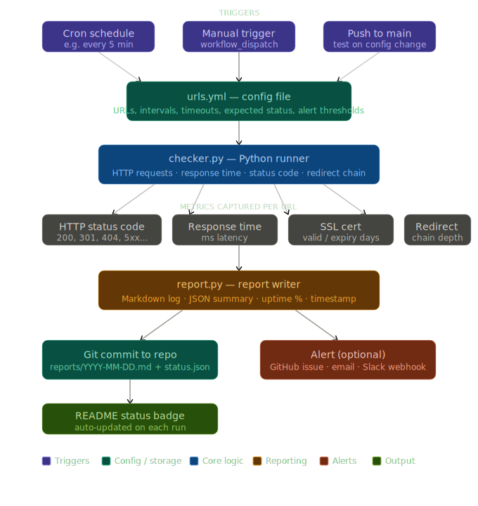

<!-- STAYAWAKEBOT_BADGE -->

<!-- STAYAWAKEBOT_BADGE_END -->
<!-- STAYAWAKEBOT_SECURITY_BADGE -->

<!-- STAYAWAKEBOT_SECURITY_BADGE_END -->

# StayAwakeBot

StayAwakeBot is a distributable (`pip install`-able) Python monitoring **and** security
toolkit. Under one `stayawake` namespace it ships two bots over a shared `core`:

- **Health sentinel** — a URL/uptime availability monitor (HTTP status, latency, TLS,
  keyword checks) that writes JSON/markdown reports and a status badge.
- **Security sentinel** — a supply-chain worm hunter that detects, alerts on, and
  auto-fixes self-propagating malware (obfuscated loaders, fake fonts, VS Code auto-run
  tasks, and stealth "evil merges"), opening remediation PRs and gating CI.

Run either bot as a **console script** locally, or as **GitHub Actions** workflows that
commit reports back to the repository — the same packaged code in both places.

## Architecture



## Quick start

```bash
pip install "stayawake @ git+https://github.com/Ndevu12/stayAwakeBot@main"
stayawake-health-check  --config config/urls.yml                    # uptime check
stayawake-security-scan --config config/security.yml --local-only   # worm scan
```

## Documentation

- [Usage](docs/USAGE.md) — install, run both bots, secrets, GitHub Actions, deploy your own
- [Configuration & Reports](docs/CONFIGURATION.md) — config file fields and report formats
- [Architecture](docs/ARCHITECTURE.md) — package layout and design principles
- [Security architecture](docs/SECURITY_ARCHITECTURE.md) — detection, remediation, prevention
- [Security baseline](prevent/SECURITY_BASELINE.md) — hardening checklist for any repo
- [Contributing](CONTRIBUTING.md) — development setup and guidelines

## License

MIT — see [LICENSE](LICENSE).
